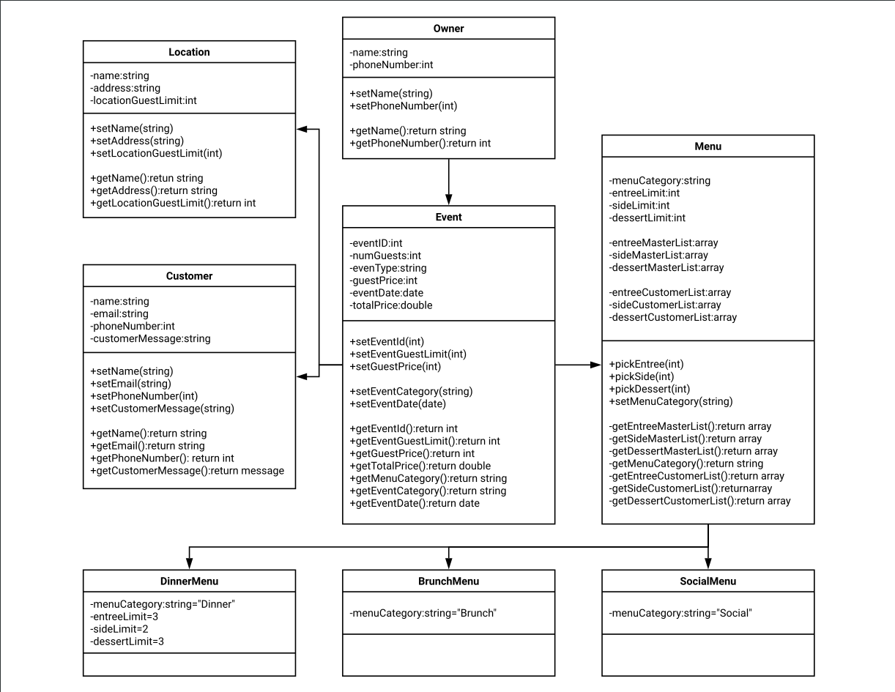

# CSC243-JavaFX-Catering-App
A catering application made in JavaFX that allows a customer to enter event information.

## Description
This was a half semester long project that taught a few things: 
  * UML Class Diagrams
  * Client requests and redesigns
  * The Agile software development approach to project management
  * Multi-Class Java Projects
  * GUI Design
  * MVC (Model, View, Controller) Design Structure
  * JavaFX 
  * Local database structure, design, and implementation

# Things I Learned From This Project

### UML Class Diagrams
The first thing I did was create a UML Diagram based on the client's requirements and needs for their application. The UML diagram outline the individual structure of each basic class, and what each one does.

### The Agile Approach
When we started the project, the client just asked for a basic CLI (command line interface) application in order for her customers to enter information about their event. 

As the project progressed, more features were added incrementally in "Sprints". Each of these sprints had new "deliverables" or features that could then be shown off to the client. This approach breaks large projects down into manageble chunks and allows the client to change their wishes over time.

Later on, the client wanted the CLI to output to a file. This was achieved in another sprint. 

After that, database support was added to the application using a local SQLite database.

Finally, a graphical application was created that had all the previous features, but presented them in a pleasing manner instead of through the terminal.

### GUI Design
This was one of my first graphical programming projects and it made me think and learn about good design practices such as:
 * When to use a radiobutton over a checkbox or something else?
 * How many screens should the user click through?
   * How should they be broken up?
 * What order should the user progress through the application?

It also made me think about how to make the application look pleasing. I used custom CSS and the JFeonix Material Design library to achieve the look I wanted. I also created a custom logo for the home screen using GIMP.

### JavaFX
This was the first time I have used JavaFX to create an application and had to learn it all from scratch. Knowing the application lifecycle and other core GUI methods taught me a lot that I will be able to transfer into other libraries and languages. It is also similar to app development structure.

### MVC (Model, View, Controller) Design Structure
I also learned about one of the most popular design patterns for organizing complex applications, MVC. MVC stands for Model, View, Controller. The Model holds all of the logic and information that makes the application useful. The View contains all of the graphical elements and changes how the application looks. Lastly, the controller is responsible for wiring up all of the graphical elements and making the application interactive.

### Database Implementation
For this project we had the option to implement a database as part of the final sprint. I chose to use a local SQLite relational database to hold all of the event and customer information. I learned how to create primary keys, autoincrementing keys, and other core database design components. The database structure had three tables that were linked together using these components. I also had to learn a new java library call JDBC. This library aids in connecting to a database and sending queries. Overall, I am thankful that I put in the extra effort to learn this essential part of modern software development.

# Program Screenshots

